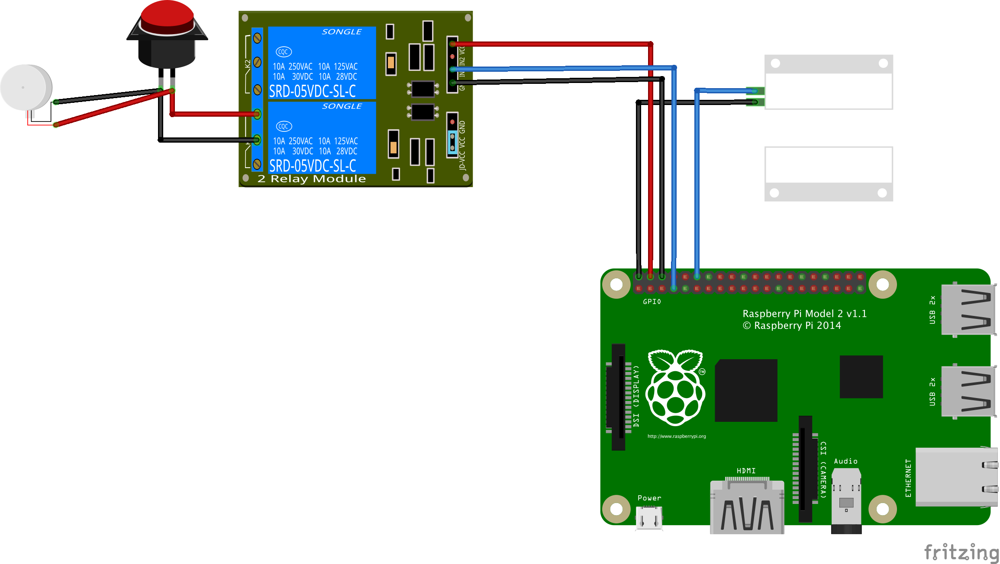

## garage remote

A nodejs server to open my garage from my couch.



Garage relay is connected to GPIO4.
Magnetic switch sensor is connected to GPIO18.

## Install the protocol buffers compiler

This project uses protocol buffers to efficiently send data from the ESP8266 to a backend server.  To install the protobuf compiler (protoc), you can install pre-built binaries or build from scratch.

Find out how to get started with the compiler [here](https://github.com/google/protobuf#protocol-compiler-installation).

> **Note** If you use Homebrew on OSX, you can install the protobuf compiler with 
> ```
> brew install protobuf
> ```

## Install and configure Nanopb

The protobuf encoder code generated by the standard protoc plugin are much too large to be loaded unto the ESP8266. Luckily, open source project [Nanopb](https://github.com/nanopb/nanopb) is a protoc plugin that can generate small plain-C code capable of running on restricted devices like the ESP8266.
